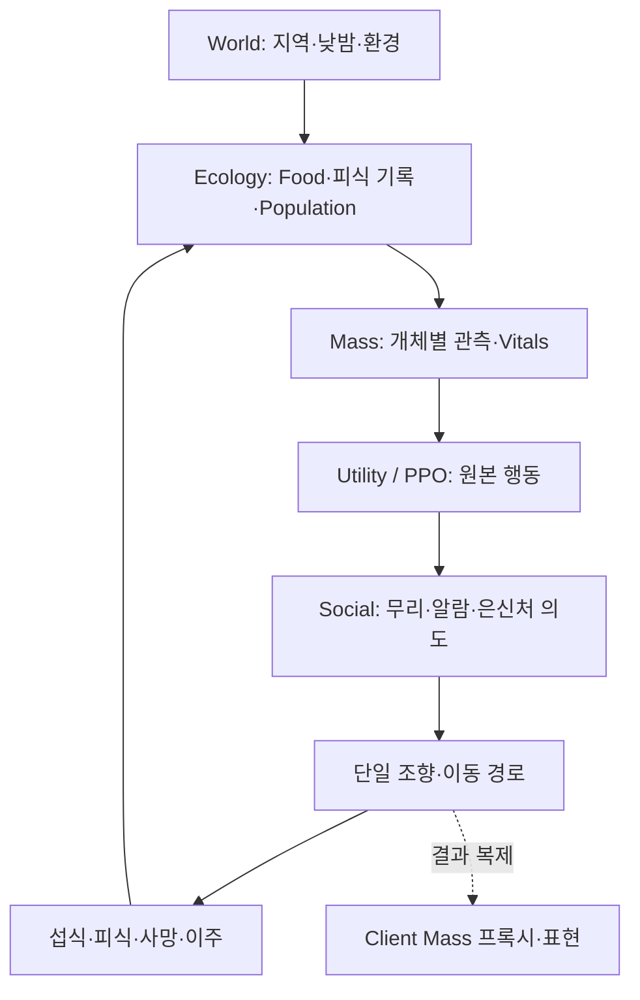

# Collaborator 개발 분석 및 동적 생태계 통합 계획

> 기준일: 2026-09-28 / 현재 브랜치: `M3` / 분석 기준 커밋: `eed75b2`
> 커밋 이력·소스·기존 Architecture/Roadmap 검토 결과이며, 이번 분석에서 빌드·런타임 테스트를 재실행하지 않았다.

핵심 판단은 **개발 방향은 적절하지만, 기능별 테스트 경로를 하나의 권위 생태계 실행 경로로 연결해야 한다**는 것이다. PPO 학습이나 은신처 예약의 완료가 Food·Energy·사망·이주·Population 전체 폐루프의 완료를 의미하지는 않는다.

## 1. 커밋 기준 개발 범위

### sinhyeok04 — 학습 정책과 Unreal 행동 실행

| 대표 커밋 | 개발 내용 | 통합에서 활용할 부분 |
|---|---|---|
| `7bf7261` | 자체 벡터화 Python 생태 학습 환경 | 먹이·에너지·포식 규칙과 평가 환경 |
| `42ad868`, `7bcac09`, `da4dbf1` | Utility 튜닝, 모방 초기화, PPO 학습, 최종 2M 모델 선택 | 같은 입출력의 Utility/PPO 전환 |
| `d597609` | 가중치 Export, 7→64→64→4 C++ 네이티브 추론, Golden Vector | Python 없이 실행하는 공유 정책 |
| `925aedf`, `30f587d`, `04a05d0` | 이웃 격자, 관측·정책·조향 Processor, Trait, 피식 EMA, 파이프라인 테스트 | Mass 개체별 행동 처리 |
| `e064afd`, `6163e3c` | 실제 위치 이동, 포획·쿨다운·은신 효과 수정, 테스트 포식자와 HUD 개선 | 이동·포획 규칙 검증 기반 |

저장된 Python 평가 결과는 평균 return **164.4 대 145.9**로 PPO 우세를 보고한다. 다만 자체 목표인 모방 대비 +20%는 **+11.2%로 미달**이며, 이 결과를 현재 Unreal 통합 생태계의 성능으로 확대 해석하면 안 된다. Unreal 시연에는 에너지 대사·실제 섭식·정식 사망 처리가 아직 연결되지 않았다.

### 조연우 — 기반 계약과 사회행동·은신처

| 대표 커밋 | 개발 내용 | 통합에서 활용할 부분 |
|---|---|---|
| `501e2ca` | 식생 재생·섭식·몬스터/식생 적응 피드백 | 과거 설계 참고. Legacy Trait Evolution 경로는 신규 생태계에 의존시키지 않음 |
| `31ab7f4`, `3ea130f` | PPO/Mass 아키텍처 전환, 지역·Mass·정책 계약과 문서 체계 | 현재 통합의 기본 책임 경계 |
| `f25aeec`, `9049344` | 무리 가입/이탈, 중심 집계, Social Trait, 테스트 하네스와 안정화 | 지속성 있는 무리 문맥 |
| `0dfb5ea`, `b4ad4b7` | 무리 위협 주입·전파·감쇠, 사회 상태와 행동 보정 | 위험에 대한 공동 반응 |
| `455fe4c`, `fb8e9dc`, `8d1a08f` | 은신처 탐색·차폐 평가·결정론적 슬롯 예약, 매칭/원점 위협 수정 | 실제 은신처 목적지와 수용 인원 관리 |

Social 문서는 무리·알람·은신처 차폐/예약 표시를 에디터 검증 상태로 기록한다. 실제 이동과 `Moving`/`Occupied` 전이는 후속 과제이며, 슬롯 경합·위협 종료 후 반환은 추가 검증 항목으로 남아 있다.

`1ed25f9`는 조연우의 네트워크 브랜치 **병합 커밋**이다. 현재 Mass 네트워크·표현 연결의 주요 구현 커밋 `bb856f2`, `0f4e96b`는 **wonkii** 작성이므로 개발 기여를 구분한다.

## 2. 현재 프로젝트와 연결할 구조

최신 원격 참조와 로컬 참조가 일치하며, `Branch_Sinhyeok` 끝 `6163e3c`와 `feat/social-shelter-mvp` 끝 `8d1a08f`는 이미 현재 HEAD의 조상이다. 추가 병합보다 아래 실행 경로를 연결하는 일이 우선이다.

**사용자 프로젝트**가 권위 상태·StableAgentId·스폰·지역 이동·복제의 기반을 맡고, **sinhyeok04 코드**가 개체의 행동 선호와 조향을, **조연우 코드**가 무리 문맥과 안전한 목적지를 제공하는 구성이 적절하다. 논리 상태는 Server Mass와 Ecology가 소유하고 Actor는 표현·상호작용 진입점으로 사용한다.

현재 작업 트리에는 World 시계·스폰 예약·Region 관련 **미커밋 작업**도 있다. 이는 진행 중인 M3 기반으로 고려하되 완료나 실행 검증을 전제하지 않는다.

## 3. Architecture에 대한 평가와 핵심 공백

공유 모델·개체별 정책 출력, C++ 네이티브 추론, Raw Action 보존, 예약 조정, Server 중심 소유권은 기존 Architecture에 부합한다. 다음 연결은 아직 필요하다.

| 항목 | 현재 상태 / 판단 | 통합 방향 |
|---|---|---|
| 자원·피식 상태 | 정책은 더미 Food와 별도 공간 격자 EMA를 사용. Ecology의 RegionId/Food/PredationHistory와 분리 | Ecology의 지역 상태를 단일 권위 저장소로 삼고 Provider는 읽기 snapshot을 제공 |
| 사회행동→이동 | Steering은 Raw Action을 직접 읽으며 `ModulatedAction`과 예약 `TargetPosition`을 소비하지 않음 | Raw 보존 → Social 보정 → 예약 목적지 → Steering 인계와 실행 순서 명시 |
| 생명주기 | 포획은 HP=0을 기록. 시연 Actor가 즉시 리스폰하며 정책/조향 쿼리에 Alive 조건이 없음 | 정식 사망·슬롯 해제·집계·복제 제거를 연결하고 죽은 개체의 행동 차단 |
| 이동 소유권 | 현재는 자체 격자와 Steering 내부 위치 적분. Architecture의 MassFlock/별도 Movement 구성과 다름 | 우선 수치가 검증된 이동 경로를 하나만 사용. Migration과 일반 이동의 동시 위치 쓰기 방지 |
| 계약·시계 | V1 문서와 실제 학습 설정·Utility·조향이 다르고 정책 주기는 8프레임/60FPS 가정 | 수치 계약과 시뮬레이션 시간 기준을 확정하고 Python/C++ 양쪽에서 검증 |

계약 차이의 대표 예는 문서의 포식자 수 정규화 기본값 **5**와 학습/생성 헤더의 **8**, 서로 다른 두 Utility 구현, 문서의 Alignment 포함 힘 합성과 실제의 일정 속력·도주 임계치 조향이다. Aquarium/`Tools/RL` 계획 역시 실제 자체 World/`herbivore_rl` 구현과 다르다. 자체 환경·격자는 합리적인 구현 선택이지만 문서가 이를 반영해야 한다. **7개 관측·4개 행동을 유지하면서 의미·단위·주기를 확정**하고, 기존 가중치가 가정한 수치를 바꾸면 재평가·필요시 재학습한다.

별도 수정이 필요한 소스 오류도 있다. `UEcoPredationProcessor`는 개체마다 `ReportPopulation(..., 1)`을 호출하지만 수신 함수는 합산 대신 `max`를 취한다. 현재 호출 경로에서는 지역 Population 분모가 1에 머물러 피식 EMA가 과대 계산될 수 있다. 이는 단순 문서 차이와 구분하여 통합 전에 수정·검증한다.

Social Subsystem은 Client 생성을 막지만 Processor 실행 플래그는 명시하지 않는다. 통합 템플릿에서도 Server/Standalone·Authority/Alive 조건을 명확히 하고, Client 템플릿에는 행동 계산용 Trait를 추가하지 않는다. 신규 순회 코드는 읽기 snapshot과 버퍼 요청을 사용하고 UObject 상태 변경은 루프 밖 조정 단계로 모은다.

## 4. 권장 개발 순서

| 순서 | 핵심 작업 | 완료 판단 |
|---|---|---|
| 1. 통합 계약 정리 | RegionId/Runtime Index·Vitals·시간 기준·관측 수치·피식 집계 통일. Server 템플릿에 Network/Herbivore/Social/Species 구성을 결합 | 같은 논리 개체를 모든 계층이 처리하며 Client는 재계산하지 않음 |
| 2. 기존 M3 완성 | M3.1 낮밤·스폰 → M3.2 소비·이벤트·공정 배분 → M3.3 고갈·실제 이주를 기존 Box로 검증. 이후 Energy·기아·사망·Utility 연결 | Food·Energy·Alive·Population이 일치하고 같은 StableAgentId가 지역을 이동 |
| 3. M4·Social 연결 | 실제 위협/사냥을 Server 이벤트로 전달. 알람·보정 행동·예약 목적지를 단일 이동 경로에 연결. 도착·사망·이주 시 슬롯 상태 정리 | 위협→무리 반응→실제 은신 이동이 보이고 사망·지역 요약이 Client에 일치 |
| 4. M5·M6 통합 검증 | 더미 Provider를 실제 지역 자원/은신처로 교체하고 PPO 활성화. Golden Vector 및 같은 생태 조건의 Utility/PPO 비교 | 행동 결과가 Food·Energy·피식 기록·Population을 바꾸고 다음 관측으로 돌아옴 |

기존 M3 계획의 **Food 재생 보류·재생률 0** 방침은 유지한다. 균일 지역 Food를 사용하는 관찰 데모를 먼저 끝내고, 후속 정책 통합에서 공간 먹이 분포와 탐색/섭식 의미를 연결한다. 공간 자원이 추가되어도 지역 총량과 별개의 자원 장부를 만들지 않는다. 스폰 웨이브는 개체 공급 규칙으로 두며 번식 구현으로 간주하지 않는다.

은신처는 동일한 데이터에서 관측용 거리와 이동용 예약 목적지를 제공하되, 두 의미를 혼합하지 않는다. 최근 피식 위험과 현재 알람도 각각 장기 지역 문맥과 즉시 사회 반응으로 구분하고, 동일 Server 사건을 입력으로 공유한다.

Social 보정·슬롯 제한·다지역 이주는 학습 때 없던 조건이다. Utility와 PPO에 같은 보정을 적용해 비교하고, Social ON/OFF로 효과를 확인한다. 추론 Golden Vector 통과만으로 전체 생태계 파리티를 판단하지 않는다. 정책 시간도 프레임 수 대신 확정된 논리 시간에 맞추어 프레임 속도 변화로 피식·행동 반응이 달라지지 않게 한다.

## 5. 역할 제안과 최종 검증

- **wonkii:** M3 실행 흐름, 지역 상태·ID·생명주기·이주·Network/Representation 통합.
- **sinhyeok04:** 관측/조향 수치 계약, 실제 Provider 연결, 피식 집계 수정, PPO/Utility 평가와 Export.
- **조연우:** 실제 위협→알람, Social→Steering 인계, 은신처 도착·점유·해제 및 예약 검증.

첫 공통 시나리오는 **A/B 지역 + 초식 1종 + 포식자/위협 + 소수 은신처**로 제한한다. Food 고갈→이주, 포식→Alive/Population 감소→위험 관측 변화, 알람→예약→실제 이동을 확인한다. 단계별 소스 변경 뒤 UE 5.8 `AdaptiveEcosystemEditor Win64 Development` 빌드와 해당 동작 검증을 수행하고, 최종적으로 Listen Server/Client에서도 같은 결과를 확인한다. 성능 확장은 이 흐름이 연결된 뒤 읽기 snapshot·이웃 조회·차폐 질의 비용부터 다룬다.

## 참고 근거

- [PPO/Mass 종합 Architecture](PPO_MASS_ECOSYSTEM_ARCHITECTURE.md), [Policy V1](../RL_Policy/POLICY_CONTRACT_V1.md), [Processor 순서](../Mass/MASS_PROCESSOR_ORDER.md)
- [M3 구현 현황·검증](../Roadmap/M3/README.md), [M5 폐루프](../Roadmap/M5/M5_PPO_CLOSED_LOOP.md)
- [Unreal 정책 통합 현황](../RL_Policy/UNREAL_POLICY_INTEGRATION.md), [Social 구현 현황](../조연우/SOCIAL_BEHAVIOR_RUNTIME_CURRENT_STATE.md)
- [학습 결과 요약](../../../herbivore_rl/docs/PROJECT_SUMMARY.md), [저장된 비교 평가](../../../herbivore_rl/results/compare.md)
- 연결 확인: `AI/Policy/EcoBehaviorProcessors.cpp`, `EcoWorldProviders.*`, `EcoRegionPredationSubsystem.cpp`, `AI/Social/Alarm/EcoAlarmProcessors.cpp`, `AI/Social/Shelter/EcoShelterProcessors.cpp`, `Mass/EcoMassNetworkTrait.cpp`, `Network/Mass/EcoMassReplicationTypes.h`.
